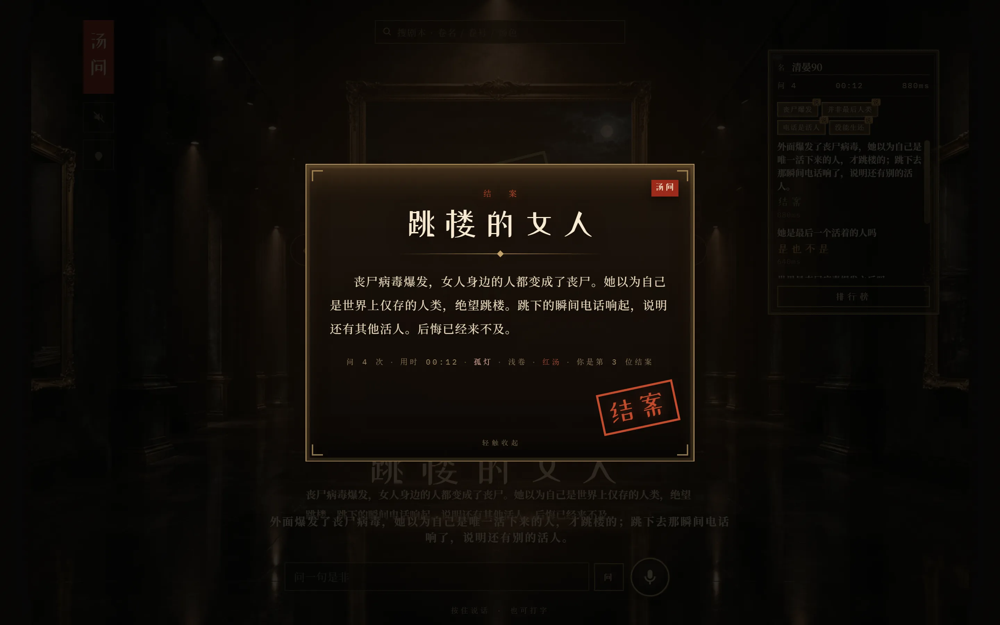
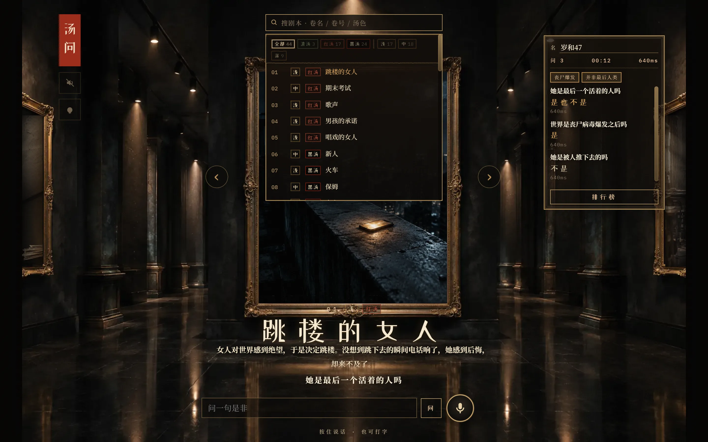
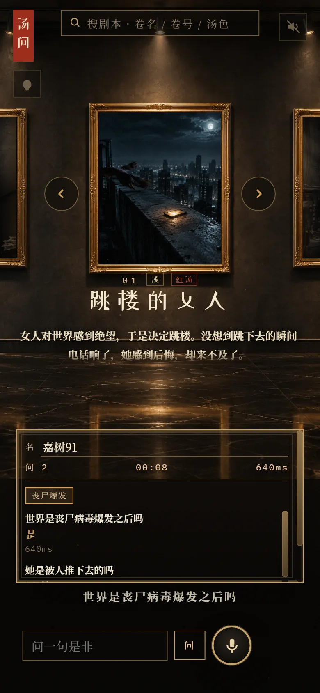

# 汤问 · 海龟汤

一间夜馆画廊。中央金框里是这一卷的汤面，两侧墙上露出上一卷、下一卷的一角。你在底栏
打字，或者按住麦克风说一句是非题，主持人只肯答「是 / 不是 / 是也不是」这些。屏幕边上
一排关键点，问到一条亮一条，那是进度；**把关键点用自己的话讲出来就结案**，不必复述
整个故事，当然把整个流程讲一遍也算。

汤底一直待在服务端，玩家猜中之前一个字节都不会发下来。


<p align="center">
  
  
</p>
<p align="center">
  
  
</p>

<p align="center"><sub>都是实机截图，用 <code>node tools/shots.mjs</code> 拍的（见 <a href="docs/testing.md">docs/testing.md</a>）。</sub></p>

44 卷中文海龟汤。前端是原生 HTML / CSS / JS，没有框架也没有构建步骤；服务端只用 Python
标准库，连 `pip install` 都不用。想自己部署，一个 zip 加一个 Python 就能跑。

## 跑起来

要 **Python 3.10+**。只有跑界面自查时才需要 Node。

```bash
git clone <this-repo> && cd turtle-soup-demo
JUDGE_MODE=offline python server.py
```

打开 <http://127.0.0.1:8765/>。Windows 上双击 `start.cmd` 等同。

一开始得加 `JUDGE_MODE=offline`，是因为判题要调大模型，而密钥得你自己去搞。不加这个
开关，程序不会崩，只是每次提问都回你「无回音」——页面看着一切正常，就是玩不动，
很容易以为是坏了。`offline` 是内置的替身：不联网、不要密钥，拿你这句话跟汤底原文比
字面重合度，能让你把提问、落印、解锁关键点、结案、上排行榜、进后台这一整条走完。
它判得不准，别拿它验口径。想知道手上这个进程跑的是哪条路，`server.py` 会在
`/api/health` 里报一个 `judge_mode`。

真判题要一把 TypeSafe 密钥：

```bash
cp .env.example .env     # 填上 TYPESAFE_API_KEY
python server.py
```

模型用的是 `jev-latest`，因为那十档印的阈值是照着这颗模型的概率分布量出来的，换一颗
就等于换一套判题口径，详见 [docs/judging.md](docs/judging.md)。

求灯（AI 给一句提示）是可选功能，不配也能玩，只是每次都回同一句兜底。本机开发可以复用
`npx wrangler login` 留下的凭据，服务器上则给 `CF_ACCOUNT_ID` + `CF_API_TOKEN`。

## 仓库里有什么

```
server.py                  HTTP 服务 + 判题编排（标准库 http.server，无框架）
puzzles.json               44 卷汤面 / 汤底 / 关键点 / 人物表 / 难度 / 汤色
web/
  index.html
  styles.css               两套坐标系：横版 1536×1024 / 竖版 1024×1536
  app.js                   推拉换卷、侧墙预览、搜索、排行榜、进度存档、浏览器语音
  audio.js                 纯 Web Audio 合成：环境音 + 音效，零音频素材
  images/*.webp            封面，*.png 是同图兜底
  admin/                   后台「账房」，零依赖单页，图是手写 SVG
functions/api/[[path]].js  Cloudflare Pages 版的同一套接口
tools/                     探针与回归脚本
docs/                      文档与封面设计稿
asr.py                     旧的服务端听写，已停用，留作回流参考
pack.py                    打部署包，含引用完整性校验
```

有两处地方值得先说一句，因为它们最容易让新人改错。

一是**同一个后端有两份实现**：`server.py` 给自建服务器和本机用，
`functions/api/[[path]].js` 给 Cloudflare Pages 用。两边共享的不是代码而是**口径** ——
十档印的名字、五个阈值、喂给模型的说明正文、`state` 里字段的顺序，各有一份同名同值的
拷贝。只改一边就是错的，而且症状是「线上偶尔判错」这种最难查的东西，所以
`tools/judge-check.py` 结尾会逐值比一遍两边，改完必须跑。

二是**几处常量是故意重复的**：CSS 里的布局常量和 `app.js` 里的阈值是一道方程的两头，
`web/index.html` 里的引导文案和首页简介是同一句话的两个出口。这类地方在
[CONTRIBUTING.md](CONTRIBUTING.md) 里列了一张「改 X 要连带动 Y」的清单。

## 文档

| 文档 | 讲什么 |
|---|---|
| [docs/getting-started.md](docs/getting-started.md) | 本机跑、环境变量全集、离线替身是怎么回事 |
| [docs/architecture.md](docs/architecture.md) | 两条链路、请求怎么走、数据存在哪 |
| [docs/judging.md](docs/judging.md) | 十档印、结案的两条路、阈值怎么量出来的 |
| [docs/hints.md](docs/hints.md) | 求灯：模型链为什么必须是链、三条硬约束、泄底闸 |
| [docs/game-data.md](docs/game-data.md) | `puzzles.json` 的格式、难度与汤色怎么定、怎么补新卷 |
| [docs/ui.md](docs/ui.md) | 两套布局、写界面时的硬约束、焦点与图片贴框 |
| [docs/audio.md](docs/audio.md) | 音效：后台静音、不许单调、高频节流 |
| [docs/telemetry.md](docs/telemetry.md) | 埋点记了什么（以及刻意没记什么）、后台怎么看 |
| [docs/deployment.md](docs/deployment.md) | 部署到 Pages 或自己的服务器、上线前自查 |
| [docs/testing.md](docs/testing.md) | 探针与回归脚本总览 |
| [docs/performance.md](docs/performance.md) | 性能与内存，附三个踩过的坑 |

改界面之前请先读 [docs/ui.md](docs/ui.md)，那里的约束基本都是踩坑之后补上的。

## 许可与语料

代码是 MIT，随便用。

**但 44 卷汤面汤底不是这个项目写的 —— 作者是抖音的「许二木」。** 语料取自他的
「许二木海龟汤文字版」合集（在 B 站，id `rl999117`），著作权在他手里，不在 MIT 的
授权范围内。放在仓库里是为了让项目开箱即用；你要商用或者大范围再分发，请自己确认授权，
或者把 `puzzles.json` 换成你自己写的题 —— 格式很直白，见
[docs/game-data.md](docs/game-data.md)。汤色的分类口径另有一处出处，同一篇里写了。

第三方内容的完整说明在 [NOTICE](NOTICE)；封面图是生图模型出的，提示词在
[`docs/design/prompts.jsonl`](docs/design/prompts.jsonl)。
